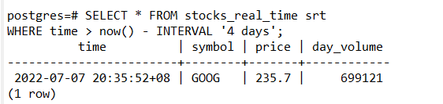
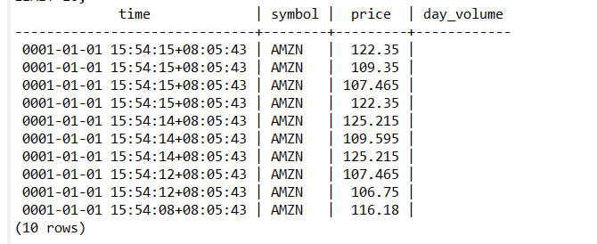

# TimeScaleDB

## About the dataset

The dataset contains second-by-second stock-trade data for the top 100 most-traded symbols, in a hypertable named . It also includes a separate table of company symbols and company names, in a regular PostgreSQL table named .stocks_real_timecompany

The dataset is updated on a nightly basis and contains data from the last four weeks, typically ~8 million rows of data. Stock trades are recorded in real-time Monday through Friday, typically during normal trading hours of the New York Stock Exchange (9:30 AM - 4:00 PM EST).

## Create a hypertable

### Creating your first hypertable

Create a regular PostgreSQL table to store the real-time stock trade data using :CREATE TABLE

```
CREATE TABLE stocks_real_time (
  time TIMESTAMPTZ NOT NULL,
  symbol TEXT NOT NULL,
  price DOUBLE PRECISION NULL,
  day_volume INT NULL
);
```

Convert the regular table into a hypertable partitioned on the column using the function provided by TimescaleDB. You must provide the name of the table () and the column in that table that holds the timestamp data to use for partitioning ():timecreate_hypertable()stocks_real_timetime

```
SELECT create_hypertable('stocks_real_time','time');
```

Create an index to support efficient queries on the and columns:symboltime

```
CREATE INDEX ix_symbol_time ON stocks_real_time (symbol, time DESC);
```

### Creating regular PostgreSQL tables

Add a table to store the company name and symbol for the stock trade data:

```
CREATE TABLE company (
  symbol TEXT NOT NULL,
  name TEXT NOT NULL
);
```

You now have two tables within your TimescaleDB database. One hypertable named , and one normal PostgreSQL table named .stocks_real_timecompany

## Table details

`stocks_real_time`: contains stock data. Includes stock price quotes at every second during trading hours.

|Field|Type|Description|
|-----|----|-----------|
|time|timestamptz|Timestamp column incrementing second by second|
|symbol|text|Symbols representing a company, mapped to company names in the company table|
|price|double precision|Stock quote price for a company at the given timestamp|
|day_volume|int|Number of shares traded each day, NULL values indicate the market is closed|

`company`: contains a mapping for symbols to company names.

|Field|Type|Description|
|-----|----|-----------|
|symbol|text|the symbol representing a company name|
|name|text|Corresponding company name|

## Query your data

### Select all stock data from the last four days

To select all the stock data from the previous four days, use the `WHERE` clause to filter the result using a relative time interval. This example uses an interval of four days, so data is displayed even if you run this on a weekend or a Monday:

```
SELECT * FROM stocks_real_time srt
WHERE time > now() - INTERVAL '4 days';
```



### Select the most recent 10 trades for Amazon in order

Use the `ORDER BY` clause to define the order of results from your query. With stock trade data, there are often multiple trades each second for popular stocks like Amazon. Therefore, you cannot order data descending by the alone. This is a common problem with high-frequency data like stocks, crypto, and IoT metrics. You need to order the results by additional information to correctly display the order in which trades were made with the exchange.`time`

For the data, the column serves as additional information to help you order the trades correctly, even when there are multiple trades per second. The value increases by the number of stocks traded with each tick.`stocks_real_timeday_volumeday_volume`

```
SELECT * FROM stocks_real_time srt
WHERE symbol='AMZN'
ORDER BY time DESC, day_volume desc
LIMIT 10;
```

